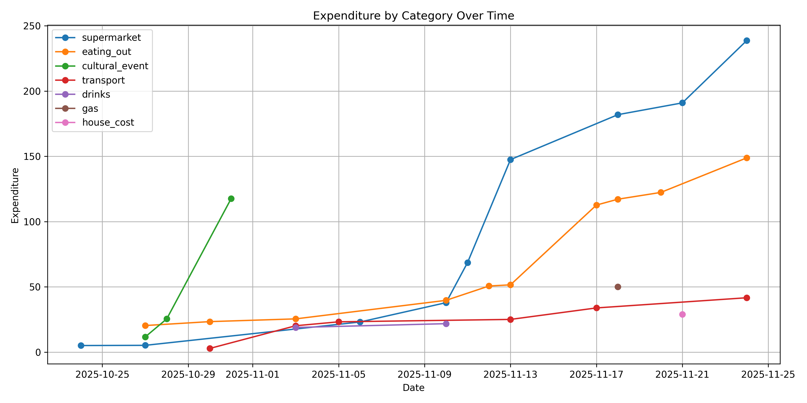

# Expenditure

Yet another cli expenses tracker (totally didn't make this because I was too lazy to read beancount's docs). 

This repo includes a set of scripts to analyse expenditures using a bank balance sheet. Banks such as Activo Bank allow you to export a spreadsheet of transactions within a given time frame. These scripts will work for any balance sheet in csv format with a top row including the labels for `[LAUNCH_DATE, VALUE_DATE, DESCRIPTION, VALUE, BALANCE]`.

## Requirements

- pandas
- matplotlib
- numpy
- rapidfuzz
- tabulate

## Configure

In the [config.json](config.json) file, you can edit:
- Which categories you are interested in.
- Clusters of categories to join in stats report.
- Plot cluster to dictate which categories to plot.
- The exact names of each column is in your input balance sheet.

## Scripts

### categorize

Quickly categorize all rows in balance sheet using a fuzzyfinder. You can save and exit at the middle of the process, return later, and forward to the first uncategorized row.

```bash
python3 categorize.py balancesheet.csv balancesheet.cat.csv
```

### stats

Get a stats report on the categorized balancesheet. To get a detailed view of a specific category, use the optional command line argument.

```bash
python3 stats.py balancesheet.cat.csv [category]
```

### plot

Plot the transactions over time.

```bash
python3 plot.py balancesheet.cat.csv
```

## Example

```bash
[all]
Category                Amount
----------------------  -----------
supermarket             -219.71 eur
tech                    -174.54 eur
health                  -132.29 eur
eating_out              -103.66 eur
cultural_event          -78.70 eur
gas                     -50.10 eur
transport               -41.69 eur
house_cost              -29.00 eur
drinks                  -21.83 eur
clothing                -5.95 eur
other                   -2.83 eur
total                   -860.30 eur

[monthly]
Category        Amount
--------------  -----------
supermarket     -219.71 eur
eating_out      -103.66 eur
cultural_event  -78.70 eur
gas             -50.10 eur
transport       -41.69 eur
house_cost      -29.00 eur
drinks          -21.83 eur
total           -544.69 eur

```

```bash
[transport]

Value      Description                                      Date
---------  -----------------------------------------------  ----------
-2.84 eur  BOLT.EU  Tallinn EE                              30/10/2025
-8.70 eur  RNE LISBOA                                       03/11/2025
-1.85 eur  Metropolitano de Lisboa CONTACTLESS              13/11/2025
-2.15 eur  PONTE 25 DE ABRIL ALMAD CONTACTLESS              17/11/2025
```


